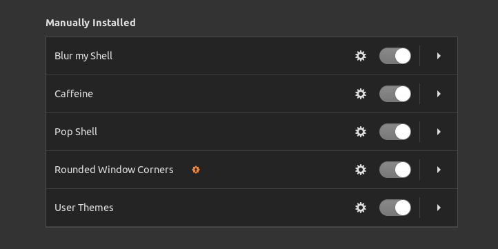

# Linux desktop setup

Notes for getting a fresh Linux install to the state these dotfiles expect.

## GNOME

### Key remapping

```sh
sudo apt update && sudo apt install input-remapper
```

### Extensions



- `caffeine@patapon.info`
- `focus-changer@heartmire`
- `blur-my-shell@aunetx`
- `logomenu@aryan_k`
- `ubuntu-appindicators@ubuntu.com`
- `dash-to-dock@micxgx.gmail.com`
- `ding@rastersoft.com`
- `tiling-assistant@leleat-on-github`
- `apps-menu@gnome-shell-extensions.gcampax.github.com`
- `auto-move-windows@gnome-shell-extensions.gcampax.github.com`
- `drive-menu@gnome-shell-extensions.gcampax.github.com`
- `launch-new-instance@gnome-shell-extensions.gcampax.github.com`
- `native-window-placement@gnome-shell-extensions.gcampax.github.com`
- `places-menu@gnome-shell-extensions.gcampax.github.com`
- `screenshot-window-sizer@gnome-shell-extensions.gcampax.github.com`
- `user-theme@gnome-shell-extensions.gcampax.github.com`
- `window-list@gnome-shell-extensions.gcampax.github.com`
- `windowsNavigator@gnome-shell-extensions.gcampax.github.com`
- `workspace-indicator@gnome-shell-extensions.gcampax.github.com`
- `tun0-ip-address@adamantisspinae.github.com`
- `showmethetext@Guleri24.github.com`

## MATE desktop

- Icons — <https://www.mate-look.org/p/1012151>
- Wallpaper — <https://www.wallpapertip.com/wpic/bJmxhh_mr-robot-elliot-pc/>
- Theme — <https://www.mate-look.org/p/1013477>
- Window borders — <https://github.com/adelapazborrero/DarkRobot>

```sh
sudo apt install mate-desktop-environment
sudo apt install mate-desktop-environment-extras
sudo apt install lightdm lightdm-gtk-greeter
sudo apt-get install lightdm-gtk-greeter-settings

sudo update-alternatives --config x-session-manager

sudo apt purge --autoremove kali-desktop-xfce

cp icons /usr/share/icons/
cp theme /usr/share/themes/
cp background /usr/share/desktop-base/kali-theme/login/background

sudo apt-get -y install aptitude
sudo aptitude -y install mate-tweak
```

### MATE on a small/HiDPI resolution

```sh
xrandr --output DP-2 --mode 3840x2160 --scale 1x1
gsettings set org.mate.interface window-scaling-factor 1
gsettings set org.mate.font-rendering dpi 128
```

In Firefox, open `about:config` and set `layout.css.devPixelsPerPx` to `1.4`.

## Battery life

Newer alternative worth a look: [auto-cpufreq](https://github.com/AdnanHodzic/auto-cpufreq#installing-auto-cpufreq).

```sh
sudo apt update
sudo apt install tlp tlp-rdw
sudo systemctl enable tlp.service
```

Checking battery health:

```sh
upower -e
upower -i /org/freedesktop/UPower/devices/battery_BAT1
```

Compare `energy-full` against `energy-full-design` — a significant gap means it is
time to replace the battery. Same idea via ACPI:

```sh
acpi -V
```

Look at `Thermal`, `design capacity` and `last full capacity`.

## RGB control

[OpenRGB](https://alternativeto.net/software/openrgb/about/)

## Ultrawide display

See [ultrawide-display.md](ultrawide-display.md).
